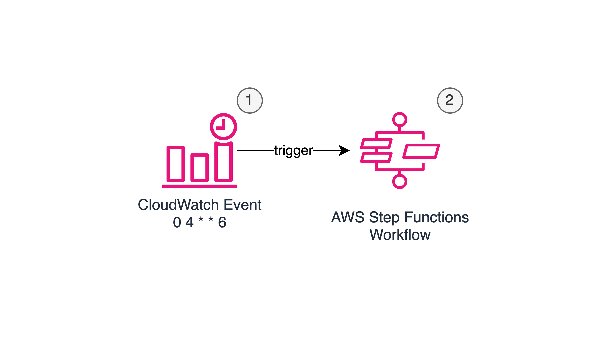
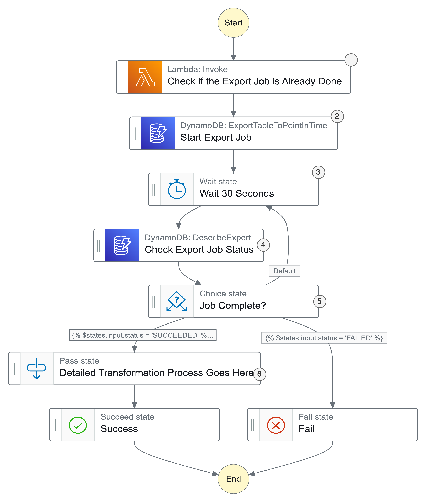
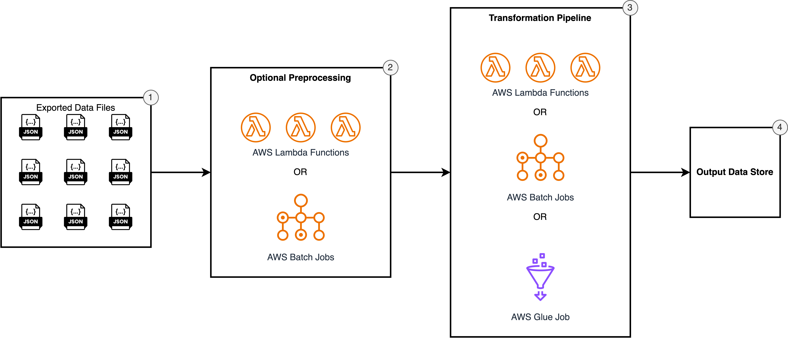

.. _mastering-full-table-exports-architecture-deep-dive-and-performance-optimization:

Mastering Full Table Exports: Architecture Deep-Dive and Performance Optimization
===================================================================================

Introduction: Unlocking DynamoDB's Analytical Potential
------------------------------------------------------------------------------
As organizations scale their use of Amazon DynamoDB, they often face a critical challenge: how to efficiently extract and analyze the valuable data stored within their tables without impacting production workloads. While DynamoDB excels at serving high-performance operational workloads, transforming its data into analytics-ready formats requires careful architectural consideration and deep technical understanding.

This technical deep-dive builds upon our previous guide, `DynamoDB Data Export: A Decision-Maker's Guide to Implementation Patterns <https://LINKHERE>`_, moving beyond pattern selection to focus on the architectural intricacies of implementing production-grade full table exports. Whether you're handling gigabytes or hundreds of terabytes of data, this guide will equip you with practical strategies for building robust, efficient export pipelines.

**Who Should Read This Guide**

This guide is designed for:

- Data engineers implementing DynamoDB export solutions
- Cloud architects designing data lake architectures
- DevOps teams managing data pipeline infrastructure
- Technical leaders evaluating DynamoDB export strategies

**What You'll Learn**

By the end of this guide, you'll understand:

- The underlying mechanics of DynamoDB's export capabilities
- How to architect reliable, scalable export pipelines
- Strategies for optimizing export performance and cost
- Patterns for handling errors and ensuring data consistency
- Approaches for transforming exported data into analytics-ready formats

About Us and Our Experience
------------------------------------------------------------------------------
As a specialized AWS solutions provider, we've implemented DynamoDB export solutions across diverse industries and scales. Our team has handled everything from modest databases to petabyte-scale deployments, giving us deep insight into the challenges and solutions around DynamoDB data extraction. This guide distills our practical experience into actionable architectural patterns and best practices.

Understanding DynamoDB Full Table Export Mechanics
------------------------------------------------------------------------------
Before diving into implementation patterns, it's crucial to understand how DynamoDB's export capability works under the hood. This foundation will inform our architectural decisions and help us build more reliable export solutions.

The Foundation: Write-Ahead Logging and PITR
~~~~~~~~~~~~~~~~~~~~~~~~~~~~~~~~~~~~~~~~~~~~~~~~~~~~~~~~~~~~~~~~~~~~~~~~~~~~~~
At its core, DynamoDB's export capability leverages a sophisticated write-ahead logging system that enables consistent point-in-time snapshots without impacting production workloads. Think of it as a detailed journal that records every change to your data, enabling DynamoDB to reconstruct your table's exact state at any moment.

When you enable Point-in-Time Recovery (PITR) for a table, DynamoDB begins maintaining this append-only log. Each modification—whether creating, updating, or deleting items—gets recorded with precise timestamps. This logging system serves three crucial purposes:

1. Enables consistent point-in-time recovery
2. Powers zero-impact exports
3. Maintains data consistency during exports

The 35-Day Window: Understanding Snapshots and Log Compression
~~~~~~~~~~~~~~~~~~~~~~~~~~~~~~~~~~~~~~~~~~~~~~~~~~~~~~~~~~~~~~~~~~~~~~~~~~~~~~
DynamoDB's PITR capability maintains a 35-day recovery window, but this isn't just an arbitrary number. The system uses a sophisticated combination of full snapshots and incremental logs to optimize storage while maintaining recovery capabilities:

- Base Snapshots: Regular checkpoints of your table's complete state
- Incremental Logs: Detailed records of changes between snapshots
- Log Compression: Automatic consolidation of older changes

This hybrid approach allows DynamoDB to:

- Minimize storage costs while maintaining recovery capabilities
- Optimize performance for different types of recovery operations
- Enable efficient exports from any point within the window

The Export Process: Behind the Scenes
~~~~~~~~~~~~~~~~~~~~~~~~~~~~~~~~~~~~~~~~~~~~~~~~~~~~~~~~~~~~~~~~~~~~~~~~~~~~~~
When you initiate a full table export using the `export_table_to_point_in_time <https://boto3.amazonaws.com/v1/documentation/api/latest/reference/services/dynamodb/client/export_table_to_point_in_time.html>`_ API, DynamoDB orchestrates a sophisticated distributed operation that never touches your live table data. Here's how it works:

1. **Export Initialization**
   - DynamoDB identifies the relevant snapshots and logs
   - Creates a consistent view of your data at the specified point in time
   - Allocates worker processes for parallel processing

2. **Distributed Processing**
   - Minimum of four concurrent workers
   - Each worker handles specific table partitions
   - Workers process both snapshots and incremental logs

3. **Output Generation**
   - Workers write processed data directly to S3
   - Data maintains partition-level organization
   - Includes metadata about the export process

This alignment with DynamoDB's native partitioning explains why your export destination contains multiple files – each corresponding to the data processed by different workers handling distinct partitions of your table. The entire process maintains consistency while maximizing throughput by working in parallel across your table's distributed structure.

Export Duration and Performance Characteristics
~~~~~~~~~~~~~~~~~~~~~~~~~~~~~~~~~~~~~~~~~~~~~~~~~~~~~~~~~~~~~~~~~~~~~~~~~~~~~~
DynamoDB's export mechanism achieves remarkable performance predictability through its distributed architecture. Since each partition is limited to 10 GB and exports run in parallel across all partitions, the total table size has minimal impact on export duration. Instead, the primary determining factor is the volume of transactions (creates, updates, and deletes) in the recent 35-day window that need to be replayed from the write-ahead logs.

This architectural design leads to highly predictable export times. Even tables containing terabytes of data typically complete their exports within a few hours, because DynamoDB's distributed system processes all partitions simultaneously, making the operation remarkably scalable. The parallel processing nature of DynamoDB exports means you can reliably estimate completion times based primarily on your recent transaction volume, regardless of total data size.

Monitoring and Control
~~~~~~~~~~~~~~~~~~~~~~~~~~~~~~~~~~~~~~~~~~~~~~~~~~~~~~~~~~~~~~~~~~~~~~~~~~~~~~
Since exports run asynchronously, DynamoDB provides a `describe_export API <https://boto3.amazonaws.com/v1/documentation/api/latest/reference/services/dynamodb/client/describe_export.html>`_ to monitor their progress. You can continuously poll the export job's status, which will indicate whether it's ``IN_PROGRESS``, ``COMPLETED``, ``FAILED``, or has completed successfully. In case of failures, the AWS Console provides detailed information about what went wrong, enabling quick troubleshooting.

For specific details about export data formats and parameters, we encourage you to refer to the `DynamoDB table export output format <https://docs.aws.amazon.com/amazondynamodb/latest/developerguide/S3DataExport.Output.html>`_ AWS official documentation, which provides comprehensive information about these technical specifications.

Now that we understand the sophisticated mechanisms powering DynamoDB's export capabilities – from its write-ahead logging to its distributed processing architecture – we can examine how organizations can leverage these capabilities to maximize their data's analytical potential.

When Full Table Export Shines: Understanding the Ideal Use Cases
------------------------------------------------------------------------------
Full table exports are particularly well-suited for specific scenarios. Understanding these use cases helps in making informed architectural decisions.

**Core Principles**

1. Full table exports operate on a different timescale than real-time or near-real-time operations. With completion times ranging from 5 minutes to a few hours, they're best suited for time-insensitive workloads where immediate data access isn't critical. This makes them ideal for batch processing scenarios and periodic analytics.
2. For smaller DynamoDB tables containing millions of items or less, full table exports often emerge as the most pragmatic choice. While other patterns like stream exports or incremental exports offer more sophisticated capabilities, they also require additional setup and ongoing maintenance. When your data volume is modest, full table exports provide a straightforward, cost-effective solution that's simple to implement and maintain.
3. For large historical datasets, full table exports can be surprisingly efficient. While the initial inclination might be to avoid full exports for large tables, DynamoDB's pricing model makes them particularly attractive. Since you're only charged for the data exported, not for read operations on your table, the cost is often negligible compared to your regular database operations. This makes full exports an economical choice even for substantial datasets, especially when real-time updates aren't required.

**Industry Examples**

Now, let's examine how different industries leverage full table exports effectively:

1. A cloud computing SaaS platform uses DynamoDB to store aggregated billing and usage metrics. Since billing reconciliation happens monthly and the aggregated data volume remains manageable, full table exports provide a simple, maintainable solution for generating monthly billing reports and analytics.
2. An e-commerce platform stores product catalog data in DynamoDB. With inventory updates happening primarily during off-peak hours and the catalog size being relatively stable, nightly full table exports efficiently feed their product analytics and recommendation systems.
3. A healthcare analytics company maintains historical patient encounter records in DynamoDB. As these records are primarily used for quarterly compliance reporting and research analysis, full table exports perfectly match their periodic processing needs while minimizing operational complexity.
4. A financial services firm stores completed transaction records in DynamoDB. Since they need to perform detailed analysis for regulatory reporting on a weekly basis and the data doesn't require real-time processing, full table exports provide a reliable and cost-effective solution.
5. A gaming company stores player achievement and progression data in DynamoDB. For their monthly leaderboard calculations and player behavior analysis, full table exports offer a straightforward way to process player data without impacting game performance.

Understanding these principles and examples helps us recognize when full table exports might be the optimal choice. However, before implementing any export strategy, it's crucial to evaluate your specific requirements around data freshness, engineering resources, and operational complexity against the predictable costs and simplicity of full table exports.

Beyond Raw Exports: Data Processing and Transformation Patterns
------------------------------------------------------------------------------
While DynamoDB's export capability provides a reliable way to extract data, most organizations quickly discover that raw exports aren't immediately suitable for analytics. The primary challenge stems from DynamoDB's specialized JSON format, known as DynamoDB JSON. This format, while perfect for DynamoDB's internal operations, differs significantly from the data structures most applications use. For instance, a simple string value in your application might be represented in DynamoDB JSON as {"S": "value"}, where "S" indicates the string type. This representation, while precise for database operations, creates a significant barrier for direct analytics use.

Consider this example:

.. code-block:: javascript

    // Your application view
    {
        "userId": "12345",
        "lastLogin": "2024-03-15",
        "loginCount": 42
    }

    // DynamoDB JSON export format
    {
        "userId": {"S": "12345"},
        "lastLogin": {"S": "2024-03-15"},
        "loginCount": {"N": "42"}
    }

This format difference means that before any meaningful analysis can begin, you need to transform the exported data back into application-friendly structures. While AWS provides powerful general-purpose data processing services like AWS Glue and AWS Lambda, the specific transformation logic for DynamoDB exports must be custom-built for each use case. This customization requirement isn't a limitation but rather reflects DynamoDB's flexibility – organizations leverage its schema-less nature in widely different ways, each optimized for their specific operational needs. In the following sections, we'll explore proven patterns for building these transformation pipelines, showing how to leverage AWS services effectively while maintaining the flexibility needed for your unique requirements.

Processing Frameworks: Choosing Your Tools
~~~~~~~~~~~~~~~~~~~~~~~~~~~~~~~~~~~~~~~~~~~~~~~~~~~~~~~~~~~~~~~~~~~~~~~~~~~~~~
When it comes to processing exported DynamoDB data, two distinct approaches have emerged, each with its own strengths and ideal use cases.

1. **File-Level Parallel Processing**

This approach leverages DynamoDB's natural export structure, where data is split into multiple files (one per partition). Each export file can be processed independently and concurrently by lightweight workers, maximizing throughput through parallel execution. This approach distributes the processing workload across multiple computing resources, with each worker focusing solely on its assigned portion of the data.

Two main options exist for this approach:

- `AWS Lambda <https://docs.aws.amazon.com/lambda/latest/dg/welcome.html>`_: Each function processes a single export file, offering maximum parallelization with minimal setup
- `AWS Batch <https://docs.aws.amazon.com/batch/latest/userguide/what-is-batch.html>`_: Runs containerized jobs, each handling individual files, providing more processing power per unit than Lambda while maintaining high parallelization

This approach shines when:

- You need fine-grained control over processing logic
- Your transformations vary based on data content

2. **Consolidated Big Data Processing**

This approach consolidates processing into powerful computational units capable of handling large data volumes simultaneously. Rather than processing files individually, it loads the entire dataset into a distributed computing framework that can efficiently process terabytes of data using sophisticated algorithms and in-memory operations. The framework automatically handles data distribution, parallel processing, and resource optimization across a cluster of machines.

Key technologies in this space include:

- Apache Spark on `AWS Glue <https://docs.aws.amazon.com/glue/latest/dg/how-it-works.html>`_: Offers sophisticated data processing capabilities with built-in optimization
- `Amazon EMR <https://docs.aws.amazon.com/emr/latest/ManagementGuide/emr-what-is-emr.html>`_: Provides a managed Hadoop framework capable of processing massive datasets

This method excels when:

- You need to process terabytes of data efficiently
- Your transformations benefit from seeing the entire dataset at once
- You require sophisticated data processing capabilities like joins or aggregations

Choosing the Right Approach: Understanding Your Data Patterns
~~~~~~~~~~~~~~~~~~~~~~~~~~~~~~~~~~~~~~~~~~~~~~~~~~~~~~~~~~~~~~~~~~~~~~~~~~~~~~
The choice between processing approaches largely depends on your data's characteristics. Let's examine three common scenarios:

**Scenario 1: Schema-Enforced Data**

When your DynamoDB table maintains a consistent schema or follows backward-compatible evolution (only adding new fields without changing existing ones), you can leverage vectorized processing. This allows you to treat your data as cohesive arrays rather than individual records, dramatically improving processing efficiency.

For schema-enforced data, both processing approaches are viable:

- Small workers can handle predictable transformations efficiently
- Consolidated Big Data Processing can leverage schema consistency for optimized vector operations

**Scenario 2: Schema-less Data**

DynamoDB's flexibility allows for completely schema-less tables, where each item might have a different structure. In these cases, you must process records individually to handle their unique characteristics.

For schema-less data:

- Small workers are the preferred choice, as they can adapt to each record's structure
- Consolidated Big Data Processing becomes less efficient, as its vectorized operations can't handle unpredictable structures effectively

**Scenario 3: Multi-Schema Data**

Many organizations store multiple types of related data in a single table, each type following its own schema. This hybrid approach requires a two-phase processing strategy:

1. Initial filtering phase: Use small workers to categorize records by their schema type
2. Processing phase: Apply either approach based on each category's characteristics
   - Use vectorized processing for schema-consistent groups
   - Apply record-by-record processing for variable structures

Once you've processed your data into application-friendly formats, a wide world of transformation and analysis options opens up. You can leverage various AWS services based on your specific needs:

- Amazon Athena for SQL-based analysis
- AWS Glue for ETL operations
- Amazon EMR for complex data processing
- AWS Lambda for custom transformations
- Amazon QuickSight for visualization

The key to success lies in matching these powerful tools to your specific requirements. By understanding your data patterns and choosing appropriate processing approaches, you can build efficient pipelines that transform raw DynamoDB exports into valuable analytical assets. In the next section, we'll explore how to ensure these transformations remain reliable and performant at scale through robust error handling and monitoring strategies.

Error Handling: Ensuring Reliable Processing at Scale
------------------------------------------------------------------------------
When processing DynamoDB export data, we're not dealing with a single, monolithic operation but rather a distributed workflow spanning multiple files and processing units. Consider a table with 100GB of data - the export might generate hundreds of files, each requiring individual processing. This distributed nature, while excellent for performance, introduces complexity in ensuring complete and accurate processing of all your data.

Think of it like managing a large-scale document digitization project where thousands of papers need to be scanned and processed. If a few pages fail to scan properly, you need a way to quickly identify which ones need attention without redoing the entire project. The same principle applies to processing DynamoDB exports - you need a reliable mechanism to track the status of each file's processing journey.

The key to robust error handling in distributed processing is implementing a reliable tracking system. This system should maintain a record of each export file's processing status, enabling you to monitor progress, detect failures, and manage retries efficiently.

Here's how you might implement such a tracking system:

.. code-block:: python

    # Example schema for a tracking database
    {
        "file_id": "export_2024_03_15_partition_1234",
        "s3_location": "s3://my-bucket/exports/2024-03-15/partition_1234.json",
        "processing_status": "COMPLETED",  # PENDING, IN_PROGRESS, COMPLETED, FAILED
        "start_time": "2024-03-15T10:00:00Z",
        "end_time": "2024-03-15T10:05:00Z",
        "error_message": None,
        "retry_count": 0,
        "last_updated": "2024-03-15T10:05:00Z"
    }

You have several options for implementing this tracking system:

1. **Using DynamoDB**: Perhaps the most straightforward approach is using DynamoDB itself. Since you're already familiar with DynamoDB, and these tracking records (typically numbering in the thousands) are small and require simple queries, DynamoDB provides a cost-effective and scalable solution.
2. **Relational Databases**: For teams already using RDS or Aurora, a simple tracking table can provide familiar SQL querying capabilities and transaction support. This approach works well when you need to integrate the tracking system with existing operational databases.
3. **Document Stores**: MongoDB or similar document stores can offer flexible schema evolution if your tracking needs grow more complex over time.

The tracking system enables several critical capabilities:

1. **Initialize Processing Records**: Create initial tracking records for all input files from an export job. This establishes the baseline for monitoring the entire processing pipeline, recording essential metadata like file locations and initial states.
2. **Update Processing Status**: Modify the status of specific files as they progress through the pipeline. This includes updating states (PENDING → IN_PROGRESS → COMPLETED/FAILED), recording timestamps, and capturing any error information for failed processing attempts.
3. **Query Failed Operations**: Retrieve a list of files that failed processing, along with their error details. This enables quick identification of problematic files and informs retry strategies based on the types of failures encountered.

This tracking system provides several key benefits:

1. **Surgical Recovery**: When processing failures occur, you can precisely identify which files need reprocessing without touching successfully processed files.
2. **Progress Monitoring**: You can track overall processing progress and identify bottlenecks or slow-running processes.
3. **Audit Trail**: The system maintains a history of processing attempts and errors, valuable for debugging and optimization.
4. **Resource Optimization**: By tracking which files have been processed successfully, you avoid redundant processing and minimize costs.

Remember, the goal isn't just to handle errors when they occur, but to maintain visibility and control over your distributed processing workflow. A well-implemented tracking system transforms what could be a chaotic distributed process into a manageable, observable operation where issues can be quickly identified and resolved.

Performance Optimization Strategies
------------------------------------------------------------------------------
DynamoDB export workloads present unique optimization challenges due to their distributed nature and variable data patterns. While the export process itself offers limited optimization opportunities, we can significantly improve the efficiency of post-export processing through strategic performance and cost optimizations.

**Vectorized Processing for Schema-Consistent Data**

When your DynamoDB table follows a consistent schema, vectorized processing can dramatically improve performance. Instead of processing records one at a time, vectorization allows us to operate on entire columns of data simultaneously. Consider a common scenario where you need to convert string timestamps to datetime objects:

However, vectorization comes with an important caveat: it requires schema consistency. If your data structure varies between records, vectorized operations may fail or produce incorrect results. Always validate schema consistency before implementing vectorized processing.

**Strategic Parallelization**

Parallel processing can significantly reduce processing time by distributing work across multiple compute resources. However, it represents a trade-off between speed and resource consumption. Consider these factors when implementing parallelization:

- Resource utilization vs. processing speed
- Data dependencies that might limit parallel execution
- Overhead of coordinating parallel processes
- Cost implications of increased resource usage

Cost Optimization Strategies
------------------------------------------------------------------------------
**Leveraging Storage for Intermediate Processing**

Storage is significantly cheaper than computation in cloud environments. We can optimize costs by strategically using storage for intermediate processing steps:

- Store parsed and transformed data in intermediate formats
- Cache frequently accessed reference data
- Persist partial results to avoid re-computation

**Two-Tier Processing Strategy**

By strategically combining low-cost and high-performance computing resources, we can optimize both cost and performance:
First Tier (Low-Cost Processing):

- Use AWS Lambda or AWS Batch for initial data parsing
- Perform basic transformations and data categorization
- Split data based on its schema based on processing requirements
- Store intermediate results in S3

Second Tier (High-Performance Processing):

- Use Apache Spark or EMR for complex transformations
- Process pre-categorized data with appropriate resources
- Perform resource-intensive operations like joins and aggregations
- Execute core business logic requiring sophisticated processing

This two-tier approach ensures that we use expensive computational resources only where they provide the most value, while leveraging cost-effective services for simpler tasks.

.. note:: Note on Export Process Optimization:

    While the DynamoDB export process itself provides limited optimization opportunities, as it's managed by AWS, we can focus our optimization efforts on the subsequent processing pipeline. The strategies outlined above help us maximize performance and minimize costs once we have the exported data, ensuring efficient end-to-end data processing.

Production Architecture: Building a Reliable DynamoDB Export Pipeline
------------------------------------------------------------------------------
Consider Global Financial Services (GFS), a mid-sized financial institution processing millions of daily transactions through their DynamoDB-powered trading platform. GFS faces a common challenge: they need to export their entire transaction history every Friday night to generate regulatory compliance reports, perform risk analysis, and update business intelligence dashboards. With approximately 50GB of new transaction data each week, they require a robust pipeline that can reliably process data according to specific compliance requirements and make it available for their analytics team by Monday morning.

Let's explore how to architect a solution that not only meets these business requirements but also ensures reliability, efficiency, and cost-effectiveness. We'll examine each component of the system and how they work together to create a maintainable solution.

Workflow Orchestration: From Triggers to Execution
~~~~~~~~~~~~~~~~~~~~~~~~~~~~~~~~~~~~~~~~~~~~~~~~~~~~~~~~~~~~~~~~~~~~~~~~~~~~~~
The workflow begins with a CloudWatch Event, configured as a cron job that executes automatically every Saturday at 4:00 AM. The CloudWatch Event triggers an AWS Step Functions workflow - our central orchestration engine. Step Functions provides the robust state management, error handling, and parallel execution capabilities essential for reliable data processing at scale. This orchestration layer serves as the backbone of our entire export pipeline.

Workflow Details: Export Job Orchestration
~~~~~~~~~~~~~~~~~~~~~~~~~~~~~~~~~~~~~~~~~~~~~~~~~~~~~~~~~~~~~~~~~~~~~~~~~~~~~~
The Step Functions workflow implements a robust orchestration process that ensures reliable and idempotent execution of our DynamoDB export jobs. Let's examine each stage of this carefully designed workflow:

**1. Check if the Export Job is Already Done**

The workflow begins with a crucial safety check implemented through a Lambda function. This function verifies whether an export job for the current time window has already completed, preventing duplicate exports if the workflow is triggered multiple times. This idempotency check is essential for maintaining data consistency, especially when dealing with automated triggers that might retry under certain conditions.

**2. Start Export Job**

Once the safety check passes, the workflow initiates the actual DynamoDB export process using the `export_table_to_point_in_time <https://boto3.amazonaws.com/v1/documentation/api/latest/reference/services/dynamodb/client/export_table_to_point_in_time.html>`_ API. This kicks off the asynchronous export operation that will create our point-in-time snapshot of the table data.

**3-4. Status Monitoring Loop**

The workflow then enters a monitoring phase with two key components:

- A 30-second wait state that provides appropriate spacing between status checks
- A status verification step using the `describe_export <https://boto3.amazonaws.com/v1/documentation/api/latest/reference/services/dynamodb/client/describe_export.html>`_ API to track the export's progress

This polling pattern continues until the export job reaches a terminal state (either success or failure).

**5. Decision Branch**

At the heart of the workflow lies a critical decision point that evaluates the export job's status:

- For successful exports (status = "SUCCEEDED"), the workflow proceeds to the transformation phase
- For failed exports (status = "FAILED"), the workflow terminates with appropriate error handling

**6. Transformation Pipeline**

Upon successful export, the workflow transitions to a transformation sub-workflow (marked as "Detailed Transformation Process Goes Here"). This placeholder represents where we'll implement our specific data processing logic, which can vary based on the processing patterns discussed in previous sections. The actual implementation of this sub-workflow will depend on factors like:

- Data schema consistency
- Processing requirements
- Performance considerations
- Cost optimization needs

This workflow design provides a foundation for reliable, production-grade export processing while maintaining the flexibility to accommodate different transformation approaches based on specific use cases.

Data Transformation Pipeline: From Raw Export to Analytics-Ready Data
~~~~~~~~~~~~~~~~~~~~~~~~~~~~~~~~~~~~~~~~~~~~~~~~~~~~~~~~~~~~~~~~~~~~~~~~~~~~~~

**Stage 1: Exported Data Files**

The transformation journey begins with the output of a completed DynamoDB export job. This consists of multiple JSON files stored in S3, each containing data from different table partitions. These files use DynamoDB's specialized JSON format.

**Stage 2: Optional Preprocessing**

This stage offers an opportunity for lightweight, cost-effective preprocessing using serverless or container-based computing resources. The focus is on preparing data for more intensive transformation operations.

Common Preprocessing Tasks:

- Converting DynamoDB JSON to standard JSON format
- Basic filtering to remove unnecessary data
- File size optimization through compression or splitting
- Schema validation and error detection
- Metadata extraction for processing optimization

Implementation Options:

1. **AWS Lambda Functions:**
    - Best for per-file processing under 15 minutes
    - Highly parallel execution capabilities
    - Cost-effective for intermittent workloads
    - Memory limits up to 10GB

2. **AWS Batch Jobs:**
    - Suitable for longer-running preprocessing tasks
    - Container-based execution for custom runtime requirements
    - Better cost optimization for predictable workloads
    - No time limits on execution

**Stage 3: Transformation Pipeline**

This stage represents the core transformation logic where the preprocessed data is converted into its final format. The choice of processing method depends on data volume, complexity, and processing requirements.

Method 1: File-Level Computation Using AWS Lambda or AWS Batch:

- Ideal for straightforward transformations
- Perfect for maintaining data isolation
- Excellent for parallel processing
- Cost-effective for moderate data volumes

Method 2: Consolidated Processing Using AWS Glue Jobs:

- Serverless Apache Spark environment
- Ideal for complex transformations
- Built-in support for various data formats
- Efficient for large-scale data processing
- Native support for schema evolution
- Built-in job monitoring and logging

Key Considerations for Method Selection:

1. Data Volume:
    - < 100GB: File-level computation often sufficient
    - > 100GB: Consider AWS Glue for better performance

2. Transformation Complexity:
    - Simple mappings: File-level computation
    - Complex joins/aggregations: AWS Glue

3. Cost Optimization:
    - Intermittent processing: Lambda/Batch
    - Regular large-scale processing: AWS Glue

**Stage 4: Output Data Store**

The final stage involves writing the transformed data to its destination. The choice of output store depends on your analytical needs and access patterns.

Common Output Options:

1. **S3 Data Lake:**
    - Stores flat files (Parquet, ORC, JSON)
    - Cost-effective for large data volumes
    - Flexible access patterns
    - Integration with AWS analytics services

2. **Data Warehouse:**
    - Amazon Redshift for complex analytics
    - Amazon Athena for serverless queries
    - Structured data optimized for analysis
    - Built-in query optimization

Output Considerations:

- Data format optimization for query performance
- Partitioning strategy for efficient data access
- Compression settings for storage optimization
- Access patterns and query requirements
- Data lifecycle management
- Security and compliance requirements

This transformation pipeline provides a flexible, scalable framework for converting DynamoDB exports into analytics-ready data, with options to accommodate various data volumes, processing requirements, and cost constraints.
Let me help you create a conclusion section that ties together the key points while setting up expectations for the next article in the series.

Conclusion and Next Steps
------------------------------------------------------------------------------
As we've explored in this deep dive, mastering full table exports from DynamoDB requires understanding both the underlying mechanics and implementing robust architectural patterns. From the write-ahead logging system that enables zero-impact exports to the sophisticated transformation pipelines that convert raw data into analytical assets, each component plays a crucial role in building production-grade export solutions.

Key takeaways from our exploration include:

- Understanding how DynamoDB's write-ahead logging and PITR features enable efficient full table exports
- Recognizing when full table exports are the optimal choice for your use case
- Implementing robust error handling and tracking systems for reliable processing
- Optimizing performance through strategic choices in processing frameworks
- Building resilient, production-ready architectures that can scale with your needs

While full table exports provide a solid foundation for many analytical workflows, they represent just one approach in the broader spectrum of DynamoDB data extraction patterns. In our next article, "Building Resilient Incremental Exports: From Development to Production," we'll explore how to implement more granular, time-based export strategies for scenarios requiring fresher data and more frequent updates. We'll examine how to handle state management, maintain data consistency, and build robust pipelines that can process incremental changes efficiently.

Until then, we encourage you to experiment with the architectural patterns and optimization strategies we've discussed. Remember, the key to successful implementation lies not just in understanding the technical components, but in aligning them with your specific business requirements and operational constraints.

Stay tuned for more insights into DynamoDB data extraction patterns and best practices. Follow our `blog <link here>`_ for updates on the next article in this series.
